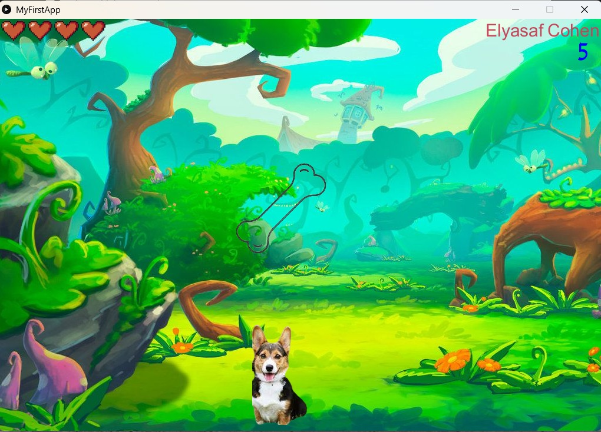
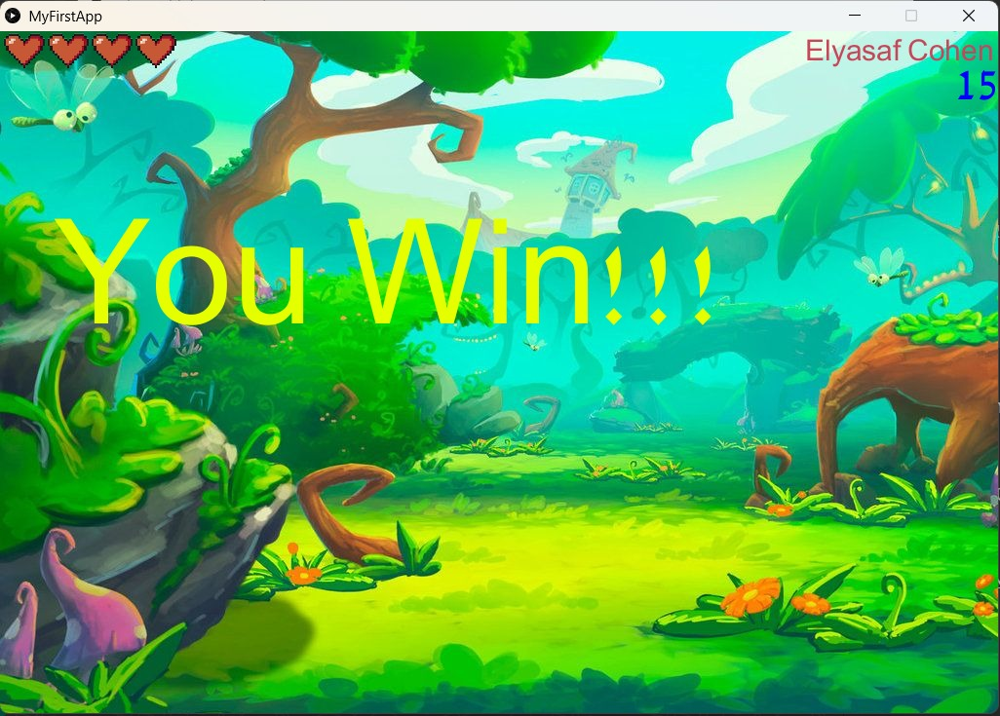
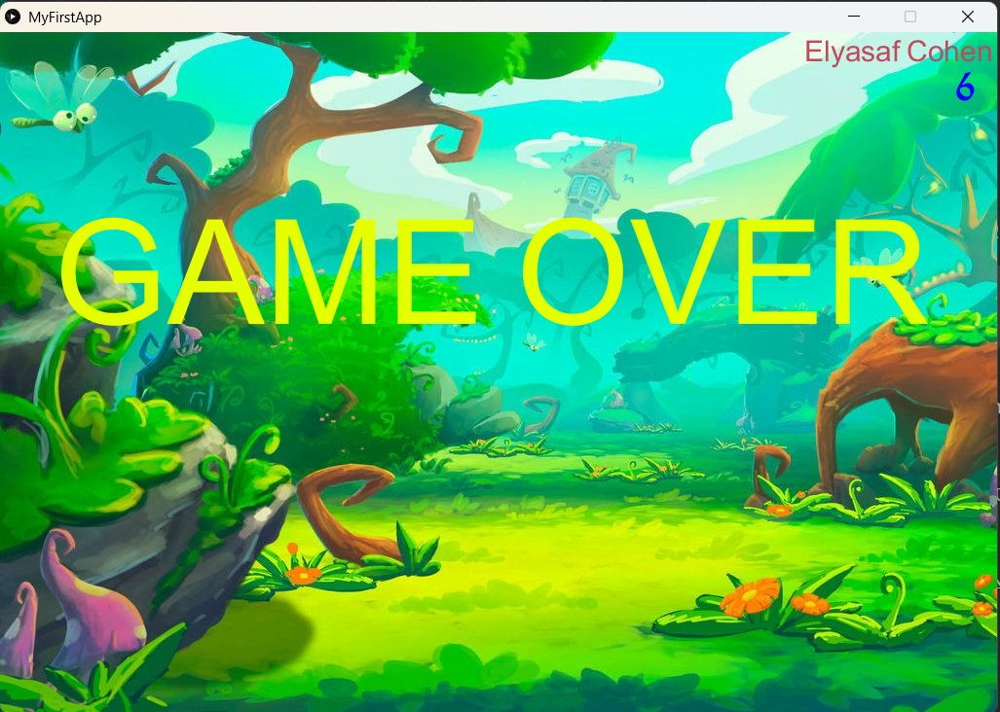

# Doggy Bones Game 🐶🦴

This is a cute and fun game made with **Processing**.

You play as a little dog who loves to eat bones!  
Try to collect as many bones as you can, and don’t lose all your hearts!

---

## 🎮 How to Play: 🎮

- Move the dog with your keyboard  
- Catch the bones  
- Don’t let the hearts run out!  
- Try to get a high score  

---

## 📁 Files: 📁

- `MyFirstApp.pde` – main game code  
- `data/` – images, sounds, and fonts  
- `nitz13D.pde` – extra code  

---

## 🖼️ Screenshots: 🖼️

### 🕹️ In-Game Screenshot 🕹️

### 🏆 Win Screen 🏆

### 🎬 Game Over Screen 🎬

---

## ✨ Made by Elyasaf Cohen ✨

GitHub: [@ElyasafCohen100](https://github.com/ElyasafCohen100)

---

> ⚡ If you like this game, please give it a ⭐ on GitHub! ✌️😎
